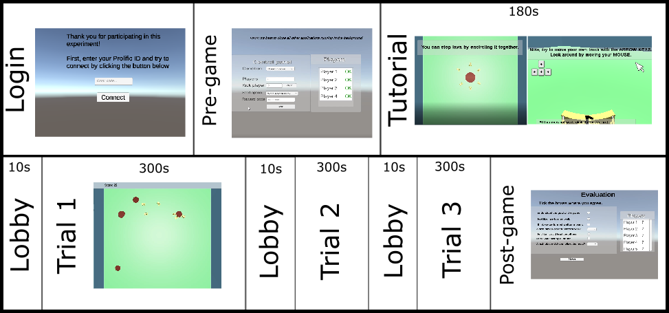
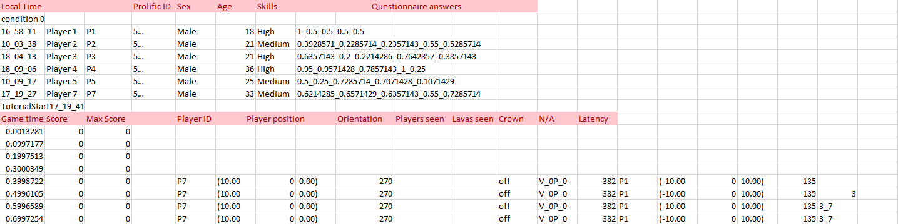
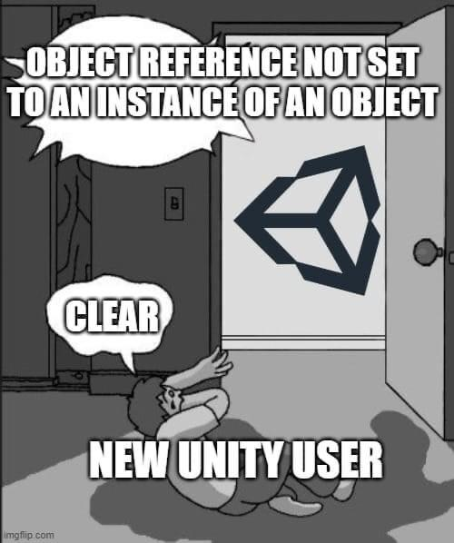
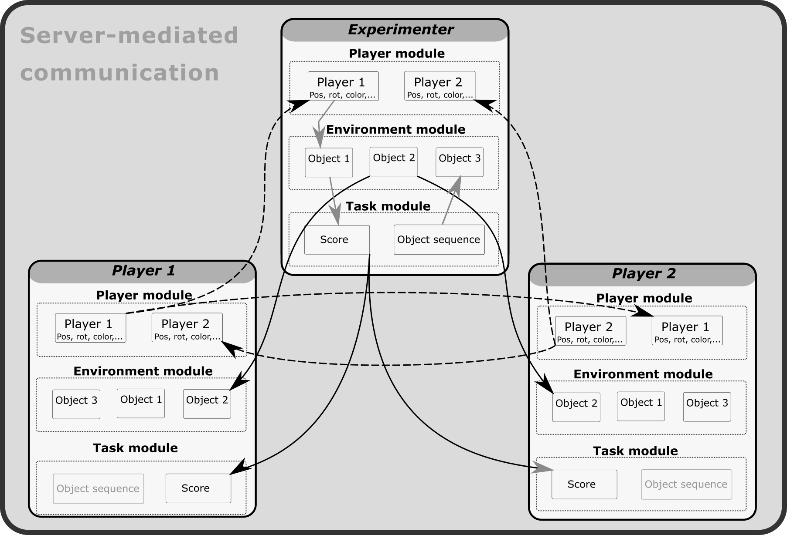

# HuGoS - Humans Go Swarming
 
 HuGoS - Humans Go Swarming - is a Unity-based framework for conducting online experiments on human collective behavior. It is especially suited for the experimental scenario's that are of interest to swarm robotics. For more info please read the [corresponding journal paper](http://iridia.ulb.ac.be/IridiaTrSeries/link/IridiaTr2020-014.pdf)
 
 
 ## Getting started
 
 Running the basic version of HuGoS only requires going through a few steps. 
 
 1. Download the Unity game engine: https://unity3d.com/get-unity/download
 2. Download the HuGoS code and open the project with Unity.
 3. Register for an account on: https://www.photonengine.com/
 4. In your Unity project, go to the Asset Store and get the "PUN 2 - FREE" package.
 5. Link the Unity project to the Photon server
      * On the Photon Engine website go to "dashboard" and click "create a new app"
      * Under "Photon Type" choose "Photon PUN"
      * Once the application is created, click "Manage" and copy the "app-id"
      * Go back to Unity and navigate to Window->Photon Unity Networking->PUN Wizard
      * Click "Local PhotonServerSettings" and paste the app id in the "App Id Realtime" field
 6. Open the script "Launcher" from the "General" folder and look for the following line of code.
       ```
          AccesCodeField.GetComponent<InputField>().text
       ```
 7. Change the assigned value to the password that you will use to log in to game sessions as experimenter
 8. Open the script "DataSender" from the "General" folder and look for the following line of code.
       ```
           string BasicPath = @
       ```
 9. Change the assigned value to the path where you want the behavioral data to be stored.

Now you're all set to run your first experiment.

## Making the experiment accessible for participants
To enable participants to participate in your experiment, they should be able to download an instance of the game and connect to the server.
To distribute the game ot participants, you can make a "build" of your game. You can either make a Windows or IOS build that participants can download to their computer. You can also make a WebGL build that participants can access in their internet browser. Clear instructions for making each kind of build can be found [here](https://www.youtube.com/watch?v=7nxKAtxGSn8&ab_channel=Brackeys). You can integrate the WebGL build in your own website or upload it for free to http://itch.io. Instructions for making your WebGL accessible in the browser using itch.io can be found [here](https://www.youtube.com/watch?v=fNLpZVNDQqc&ab_channel=N3KEN). When these steps are completed, participants can acces the game build by going to the itch.io link that you provide them. Once participants have loaded the starting page of your game, they can connect to the server by entering their name or ID number and clicking the connect button (that is, after the experimenter has initiated the game session, see below).

## Running a basic experiment
The version of HuGoS provided here comes with a basic task that requires participants to barricade as much lava as possible from different spills that are randomly appearing in the environment. Without any changes to the code, 4 conditions of this task are supported: the basic condition, the signalling condition, and the stigmergy condition (please see [our paper](http://iridia.ulb.ac.be/IridiaTrSeries/link/IridiaTr2020-014.pdf) for more details). Before starting an experiment, the experimenter should first schedule a session, recruit the desired number of participants, provide them with the link, and request them to log in at the scheduled time. 




A few minutes before the scheduled time, the experimenter can open the experiment session by logging in with their password. Once logged in, the experimenter enters the *game lobby* and sees a *control panel* where they can change the experimental condition, and the desired number of players. From the moment the experiment session is opened, participants can also enter the game lobby. Unlike the experimenter, participants are presented with a statement of informed consent and a pre-game questionnaire. Once a participant has completed the questionnaire, a green "OK" appears next to that player in the experimenter's view. The experimenter can also choose to *kick* a particular player from the experiment session. The experimenter can choose to either start the experiment automatically, when all participants completed the questionnaires, or manually by pressing the "override start" button.

The experiment begins with a passive tutorial, where participants see a video explaining the task from a birds-eye view. Next comes the active part of the tutorial, where participants can control an avatar from a first-person perspective while further instructions are appearing on the screen. The participants keep this first-person perspective for the remainder of the experiment. The experimenter, on the other hand, keeps seeing a bird's eye view of the experiment, and can also choose to kick participants during the experiment (for example, when they are inactive for a certain period). In the current implementation, an experiment session comprises 3 rounds of 5 minutes each. After the third round, participants get redirected to the end lobby, where they complete another set of questionnaires.

## Handling behavioral data
### Recording data to your computer
If you correctly modified the data storage path, as indicated in step 8 of "Getting started", then the behavioral data of each experiment session should be automatically saved to your specified path. At the beginning of each experiment seesion, i.e., when you log in as experimenter, a new .csv file is created with the current data and time as it's name. **Do not open this file while the experiment is running**, as this will prevent data from being stored. The first few lines of the file will consist of participant's answers to the questionnaires. If you wish to change how the questionnaire data is stored, you can open the "SaveAnswers" script and modify the line of code that starts with the following. 
```
QuestionString = DateTime.Now.ToString("HH_mm_ss")
```
After the tutorial phase, each player starts sending his individual data (position, rotation, field of view,...) to the experimenter, who in turn saves it to the .csv file. To modify which data each player sends to the experimenter, open the "PlayerManager" script and look for the line of code that starts with the following.
```
Temp_player_data = pingTime.ToString()
```
 At each timestep, the experimenter instance saves both data related to the task (such as score and spill size) as well as the behavioral data received from the players. This is taken care of in the "DataSender" script. In the current implementation, data is stored 10 times per second. If you fish to change this frequency, modify the last number in the following line of code.
```
InvokeRepeating("StoreGameData", 1f, 0.1f);
```

### Parsing the data
The .csv file will contain the saved experiment data as specified above. Depending on your needs, you can import this file in, e.g., Matlab or Python, and write a script that extracts the data you want to analyze. This will probably require some nested loops in order to extract, for example, the positional data of each player at each point in time. As an illustration, the figure below shows part of a .csv file saved from the pilot studies reported in [our paper](http://iridia.ulb.ac.be/IridiaTrSeries/link/IridiaTr2020-014.pdf). The red cells been manually added to indicate how the data can be indexed.


### Sending data to a Google Sheet
Saving data locally to the experimenter's work station is the most straightforward way to store the gamedata. Alternatively, data can also be directly sent to a Google Sheet. This has the advantage that data could remain being recorded in case the experimenter were to experience connection issues. With some further modifications, it could also allow for experiments to be run without the presence of an experimenter. However, this approach causes additional bandwidth usage and is a potential point of failure so it is recommended to not use this approach when not strictly necessary.

To enable online data storage, we have to link the Photon Server with a Google Sheet via a *webhook*, for which we can use [Pipedream](https://pipedream.com/). 
Follow the these steps:
1. In the "DataSender" script, use the function "OutputCommondata" to send data to a webhook at each timepoint by including it in the "StoreGameData" function.
2. Make sure the data you want to send is included in the variable "GameArray" in the following line of code.
   ```
   object[] content = new object[] { GameArray };
   ```
3. Create an account on https://pipedream.com/
4. Create a new workflow and copy the example code [provided here](https://pipedream.com/@NicolasCoucke/pilot_game_data-p_7NCbRr)
5. Link your Google account and fill in the Spreadsheet ID of your Google Sheet in the two indicated locations
6. Copy the webhooklink from the top of the workflow (ending with .. .m.pipedream.net)
7. Go to your Photon Dashboard->manage your app->Webhooks and paste your link in the "BaseUrl" field

## Implementing a custom experiment
Unity offers the possibility to implement nearly every imaginable experimental scenario. Implementing a scenario requires some knowledge of the tools and possibilities available in Unity. The HuGoS code provides a convenient template suited to behavioral experiments that can be incrementally modified to one's own experimental setup. We first clarify concepts that are important to understand when you start to make changes, befere describing the structure of the HuGoS code, and suggesting some straigtforward changes that can be made to the current implementation.

### Some basic notions 

#### Scenes, Scripts and GameObjects
In Unity, all gameplay happens within a certain *Scene*. Every time a new scene is loaded, all elements in that scene are newly instantiated. During the course of an experiment, you can jump from scene to scene by instantiating a new scene while still in the current scene. In HuGoS, there are different scenes for the lobby, the tutorial, the actual experiment trials, and the post-experiment lobby. For each of the 3 trials in the current implementation, the same scene is reloaded again. Using Photon, we can jump from one scene to the next using the following statement.
```
PhotonNetwork.LoadLevel("Tutorial");
```
When a scene is loaded, it instantiates sevaral *GameObjects*, as predefined by the experimenter during development. A GameObject can for example be a UI element, a player avatar, or simple landmark element. Each GameObject can be a parent and/or a child object of other objects. A gameObject can posses sevaral components. For example, the player avatar GameObject has a mesh component that makes it visible in the game. Components can also be scripts that control how a particular GameObject behaves, or reacts to user input. Not every GameObject necessarily needs to be a 'physical' 3D object in the envrionment; some objects are 'empty' and merely serve to instantiate and execute a script that controls the game mechanics. The "GameManager" object and corresponding scripts are a good example of this.

Sometimes, we wish to have multiple versions of the same GameObject in our scene. We can achieve this by making our GameObject into a *Prefab* by dragging it from the "Hierarchy" window to the "Asset" window. For example, we can make one lava-object, turn it into a prefab, and then spawn multiple lava-objects at different times and places in the scene. Each instance of this gameObject has it's own instance of all components and scripts. That means that, although each lava-component might have the same "LavaGenerator" script, each of those scripts is executed independently. We can however have variables and functions that are always updated and executed across all instances and scripts. To do this, we make these variables or functions *static* by simply placing the word "static" in front of them when defining them.:
```
public static float Total_Score;
```
Having these static variables and functions in your code can become quite cumbersome and often leads errors; it is easiest to avoid using static variables in most cases by always dealing with the concrete instantces of scripts. 



However, sometimes we do want some information to remain static. For example, when we start a new scene and all objects and scripts are re-instantiated, we still want to know in which experimental condition we currently are. In other words, we want a variable "condition" that remains static throughout the whole experiment. The way this is dealt with in HuGoS is through the script "StaticVariables". This script is not linked to any scene or GameObject, but can be used to write and read variabes throughout the experiment.

Not only can we have different instances of the same GameObject prefab in a scene, each client (participant) also has their own version of all these instances on his local computer. For example, each player has their own instance of all players on their local computer (see the figure below). A player can only control his own avatar, and the resulting movements have to be passed through the network to make his avatar also move on the computer of all the other players. In the next section we'll see how this communication between clients works.


#### Sending information across the network
In HuGoS, each participant downloads his own instance of the game (in their browser, for example). When a participant logs in, he connects to the Photon game server as a client. When you log into the server as the experimenter, you are the *Spectator* or *MasterClient*. Some parts of the game can be executed locally on the client (e.g., showing a sequence of tutorial texts), while other parts need to be synced through the server. As the masterclient, the experimeter can tightly control the course of the experiment. For example, although a sequence of tutorial texts can be executed locally by the client, the trigger for starting the sequence is sent from the masterclient through the server to all clients. Most of the communication through the server happens between the masterclient and the other clients. Other clients also pass some information directely to each other, such as their avatar position.

Every script that communicates via the server should be attached to a GameObject that conaints a *PhotonView* element. Clients can send information to each other via this PhotonView. Photon contains a ready-made solution for synchronizing avatar position and rotation across the network. This can be implemented by adding the "Photon Transform View" to your avatars GameObject. If you wish to send other information/events across the network, then you should add the script from which you want to send this information to the "Observed Components" field in the PhotonView. Now let's look at how to send information from your script.

Say that you change of experimental condition in the control panel, and want to inform all clients of that change. To achieve this, you can link the UI element where you indicate the condition to trigger a function in a script that is attached to a PhotonView, for example: 
```
public void ConditionChange()
{
  Condition = ConditionDropdown.GetComponent<Dropdown>().value;
  photonView.RPC("ChangeCondition", RpcTarget.All, Condition); 
}
```
In the first line of the function, we extract which condition we want the experiment to run in from the UI element; in the second line we send this information to the other clients via a *Remote Procedure Call* (RPC) from our photonView. As arguments, we pass the name of the function we want to execute remotely, the target clients (all of them), and the argument we want to pass to the remotely called function. Now let's look at the function we call remotely: 
```
[PunRPC]
public void ChangeCondition(int Condition)
{
   StaticVariables.Condition = Condition;

}
```
We indicate that this function is used to be called remotely by writing \[PunRPC] on top of it. Each client recieves the call to the function, together with the function argument (Condition) from the Masterclient via the server to his own photonview, and then executes it locally. If we only want to send something to a specific player, the easiest way to achieve this is to pass the player-id of the player you want to send the message to as a function argument to you RPC function, and then include an if-statment that makes sure the action is only executed for that specific player. For example, the remotely called function for kicking a specific player from the game is implemented as follows.
```
[PunRPC]
public void KickPlayerSide(int PlayerToKick)
{
    if(PhotonNetwork.LocalPlayer == PhotonNetwork.PlayerList[PlayerToKick])
    {
        MainCanvas.SetActive(false);
        Disconnectedpannel.SetActive(true);
        PhotonNetwork.Disconnect();
    }
}
```
### An overview of the scripts
These are the most important scripts that have to be adjusted when changeing the experiment setup.

* **Staticvariables** saves and stores all variables that have to be kept track of between scenes during the course of the experiment, for example the participant ID's, the experimental condition, and the current trialnumber.
* **Launcher** is active when a participant first opens the game, allows a participant to enter his ID and use this ID to connect to the server.
* **PreLobbyWork** takes care of game mechanics in the lobby, lets participants run through questionnaires and keeps track of the player count in the lobby.
* **SaveAnswers** records the participants' answers to the questionnaires and saves them to the computer of the experimenter
* **TutorialLauncer** starts the tutorialscene when all players are ready filling in the questionnaires

* **GameManager** spawns players in the game, keeps track of game duration and loads next scene when time limit reached
* **LavaSpawnerv2** spawns sequence of lava spills in each trial, receives the score associated with each spill and aggregates them to achieve a global score
* **LavaGenerator** is a component of each lavaspill, makes the spill grow, detects players at it's edges and updates the spill mesh accordingly
* **PlayerManager** calculates variables specific to a player, such as which other players are in their field of view, and makes that information available for data storage
* **PlayerController** accepts user keyboard input
* **PlayerMotor** executes avatar movements based on input received from PlayerController
* **DataSender** collects data from the LavaSpawnerv2, PlayerManager, and GameManager scripts and saves them locally in a .csv file

* **EndLobbyWork** handles post-game questionnaires in the last scene of the experiment

Some of these scripts have a version that is specific to a tutorial (with prefix "TUT" or "TUTPART1") or to the stigmergy condition (with prefix "BLOCK")

### Easy changes to make

**The content of the questionnaires** can be changed by going to the "PreRoomLobbyScene"-> Hierarchy->Canvas->Panel and changing the text input for the different UI elements.
**The tutorial text** can be modified by going to the "TutorialScene"->Hierarchy->TutorialCanvas and changing the text input of the elements.
**The number of trials** can be changed by changing the variable "NumberOfGames" in the GameManager and **adding a new spawning sequence** in the LavaSpawnerv2 script by modifying the funtion "DefineSequence".
**The player avatar** can be easily changed by going to Assets-> resources -> PlayPref and changing the "Bulldozer" mesh to a 3D mesh of your choosing

Other recommended changes and experiment variations will be added incrementally added.


## Further reading

* [Getting started with Unity](https://unity.com/learn/get-started)
* [Learning C# and coding in Unity](https://unity3d.com/learning-c-sharp-in-unity-for-beginners)
* [Photon Unity Networking Tutoial](https://doc.photonengine.com/zh-CN/pun/v2/demos-and-tutorials/pun-basics-tutorial/intro)
* [Making a Multiplayer Game (video tutorial series)](https://www.youtube.com/watch?v=phDySdEKXcw&list=PLWeGoBm1YHVgXmitft-0jkvcTVhAtL9vG&ab_channel=InfoGamer)
 

